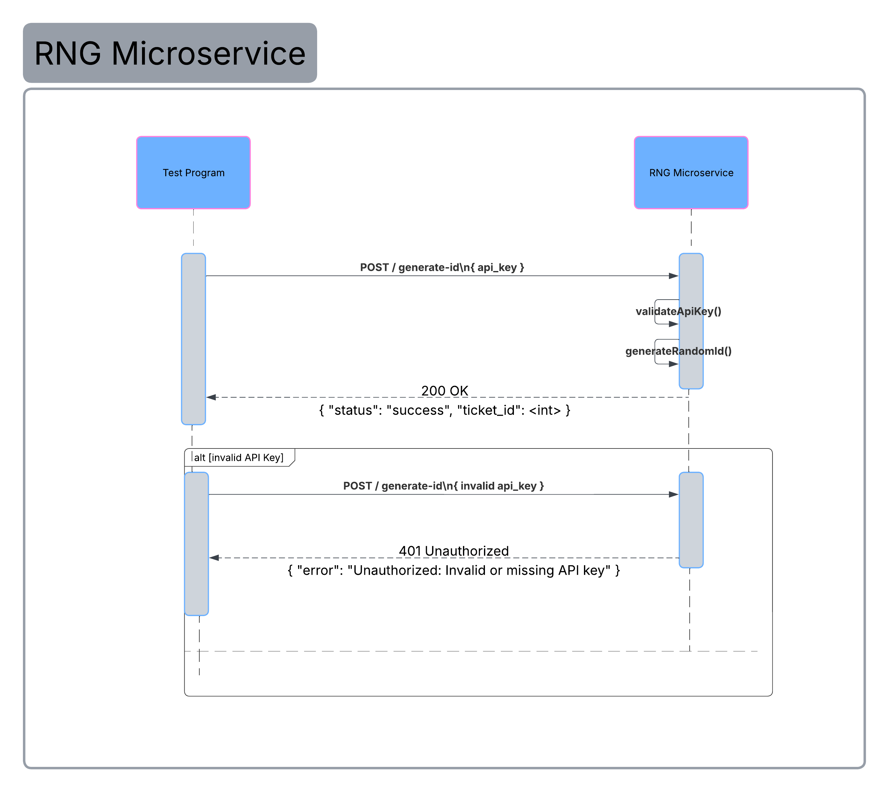

# RNG MICROSERVICE

OVERVIEW
This service generates a random ticket ID for authorized users.

## HOW TO REQUEST DATA
To request a ticket ID, you must send an HTTP POST request to the /generate-id endpoint. The request must include a JSON body containing a valid api_key.

## EXAMPLE REQUEST (Using Python urllib)
```python

import urllib.request
import json

url = "http://localhost:5001/generate-id"
payload = {"api_key": "A3F91C2B44F0E1D9B07C8E5A12F4B6D3"}
data = json.dumps(payload).encode('utf-8')
req = urllib.request.Request(url, data=data, method='POST')
req.add_header('Content-Type', 'application/json')
response = urllib.request.urlopen(req)
```

## HOW TO RECEIVE DATA
The service will respond with a JSON object. If the request is successful, the response will have a status of 200 OK and contain a 'status' field and a 'ticket_id' field. If the API key is missing or incorrect, it will return a 401 Unauthorized error.

## EXAMPLE RECEIVE (JSON Response)
```json
{
    "status": "success",
    "ticket_id": 482931
}
```
## UML Sequence Diagram

The diagram below illustrates how the Test Program sends a POST request to the RNG Microservice and how the microservice validates the API key and returns a response.

